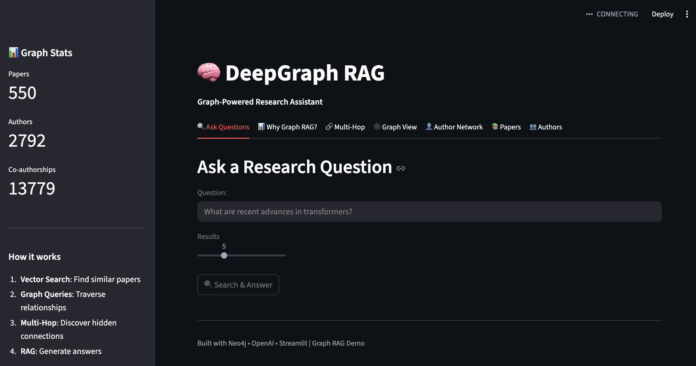

# DeepGraph RAG

[](https://opensource.org/licenses/MIT)
[](https://www.python.org/downloads/)
[](https://neo4j.com/)

**Graph RAG for intersection queries. Find things that HAVE X FOR Y.**

Vector search: *"Find things about X"*
Graph RAG: *"Find things that HAVE X FOR Y"*

<p align="center">
  
</p>

---

## Why Graph RAG?

Graph RAG solves one specific problem: **intersection queries across structured relationships**.

| Query | Vector Search | Graph RAG |
|-------|:-------------:|:---------:|
| "Papers about transformers" | :white_check_mark: | :white_check_mark: |
| "Papers USING transformers FOR reasoning" | :x: | :white_check_mark: |
| "Wireless headphones" | :white_check_mark: | :white_check_mark: |
| "Wireless headphones FOR running under $100" | :x: | :white_check_mark: |
| "Symptoms patients report but research ignores" | :x: | :white_check_mark: |

---

## Three Demos, One Pattern

<table>
<tr>
<td width="33%" align="center">

### :microscope: Research Navigator
**Method x Concept**

*"Papers using transformers for reasoning"*

1,000 arXiv papers

</td>
<td width="33%" align="center">

### :shopping_cart: Product Navigator
**Feature x UseCase x Price**

*"Wireless headphones for running under $100"*

500 electronics products

</td>
<td width="33%" align="center">

### :brain: Neurology Navigator
**Research vs Patient Gaps**

*"Symptoms patients report but research ignores"*

495 papers + 31K patient reports

</td>
</tr>
</table>

All three use the same graph pattern:

```
Entity ──→ HAS_CAPABILITY ──→ Capability
  └──→ FOR_INTENT ──→ Intent
```

| Domain | Entity | Capability | Intent |
|--------|--------|------------|--------|
| Research | Paper | Method | Concept |
| Products | Product | Feature | UseCase |
| Neurology | Paper/Post | Symptom | Disease |

---

## Quick Start

```bash
# Clone
git clone https://github.com/EHeadless/deepgraph-rag.git
cd deepgraph-rag

# Install
pip install -r requirements.txt

# Configure
cp .env.example .env
# Add your OPENAI_API_KEY to .env

# Start Neo4j
docker-compose up -d

# Run the landing page
streamlit run landing.py --server.port 8500
```

Then open http://localhost:8500

See [SETUP_GUIDE.md](SETUP_GUIDE.md) for detailed instructions including data loading.

---

## Project Structure

```
deepgraph-rag/
├── landing.py                    # Main landing page
├── api.py                        # FastAPI REST backend
│
├── examples/
│   ├── arxiv/                    # Research Navigator
│   │   └── app.py                # Method x Concept queries
│   ├── products/                 # Product Navigator
│   │   └── app.py                # Feature x UseCase queries
│   └── neurology/                # Neurology Navigator
│       └── app.py                # Research vs Patient comparison
│
├── deepgraph/                    # Core library
│   ├── core/schema.py            # Domain-agnostic schemas
│   ├── store/neo4j.py            # Graph database
│   └── retrieval/vector.py       # Vector search
│
├── scripts/                      # Data pipelines
├── docker-compose.yml            # Neo4j setup
└── requirements.txt
```

---

## Ports

| Service | Port | URL |
|---------|------|-----|
| Landing Page | 8500 | http://localhost:8500 |
| Research Navigator | 8505 | http://localhost:8505 |
| Product Navigator | 8506 | http://localhost:8506 |
| Neurology Navigator | 8507 | http://localhost:8507 |
| Neo4j Browser | 7474 | http://localhost:7474 |
| REST API | 8000 | http://localhost:8000/docs |

---

## When to Use What

| Demo | Differentiation | Best For |
|------|-----------------|----------|
| **Products** | :star: High | E-commerce filtering. People think in Feature + UseCase + Price. |
| **Neurology** | :star: High | Dual-source comparison. Research gap analysis is unique. |
| **Research** | :star: Medium | Paper discovery. (Semantic Scholar already does this well.) |

---

## Tech Stack

- **Graph Database:** Neo4j 5.x with vector indexes
- **Embeddings:** OpenAI text-embedding-ada-002
- **LLM:** GPT-4 for entity extraction
- **UI:** Streamlit
- **API:** FastAPI
- **Visualization:** pyvis

---

## Contributing

See [CONTRIBUTING.md](CONTRIBUTING.md) for guidelines.

---

## License

MIT - see [LICENSE](LICENSE)
